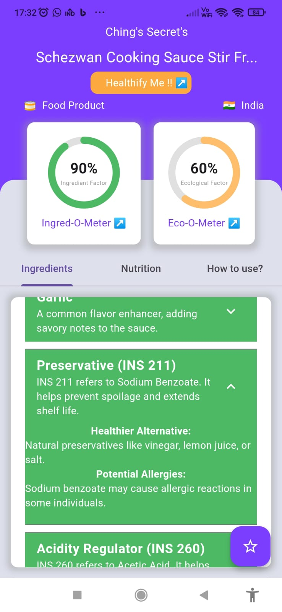

# 🔬 Deep Scan: Your AI-Powered Product Analyzer 🚀

Deep Scan is a cutting-edge Flutter app that brings the power of AI to your fingertips, allowing you to analyze products like never before! 📱✨

## 🌟 Features

### 🔍 Advanced Product Scanning
Scan food, cosmetics, supplements, and more! Our app uses Google's Gemini AI to provide in-depth analysis of your products.

### 🧪 Ingred-O-Meter
Get an instant safety percentage for ingredients. Higher is safer! 

### 🌿 Eco-O-Meter
Discover how eco-friendly your products are with our Eco-O-Meter.

### 🗺️ Origin Tracking
Know where your products are manufactured.

### 📋 Comprehensive Ingredient Analysis
- Detailed breakdown of all ingredients
- Healthier alternatives suggested
- Potential allergy warnings

### 🍎 Nutritional Deep Dive (for food items)
- Calorie content
- Macro and micronutrients
- Diet compatibility (Vegan, Keto, Gluten-free, etc.)
- Allergen information
- Comparative analysis and recommendations

### 📖 How-to-Use Guide
Get detailed instructions on:
- Pre-use preparations
- Safety precautions
- Step-by-step usage
- Storage instructions
- Contact information

### 🔬 Advanced Analyses
- Ingredient deep dive: Side effects, regulatory compliance, and more
- Ecological impact: Packaging, recyclability, carbon footprint, and sustainability metrics

### 🏠 Healthify Me!
Get homemade recipes to recreate products healthily.

### 🌐 Web Integration
Check out our [web app](https://deepscan-5617d.web.app/) for product rankings and more!

## 📸 Screenshots

[Insert your app screenshots here]

## 🛠️ Technologies Used

- Flutter for cross-platform mobile development
- Google's Gemini AI for advanced product analysis
- Firebase for backend storage and web app hosting

## 🚀 Getting Started

1. Clone the repository
2. Install dependencies: `flutter pub get`
3. Run the app: `flutter run`
4. Change the .env.example to .env

## 🙏 Acknowledgments

- Google Gemini AI team for their amazing LLM
- Flutter community for continuous support and inspiration

---

Made with ❤️ by [Saurav Ganguly (Developer) / Anishmeta Mitra (UI / UX Degisner)]
